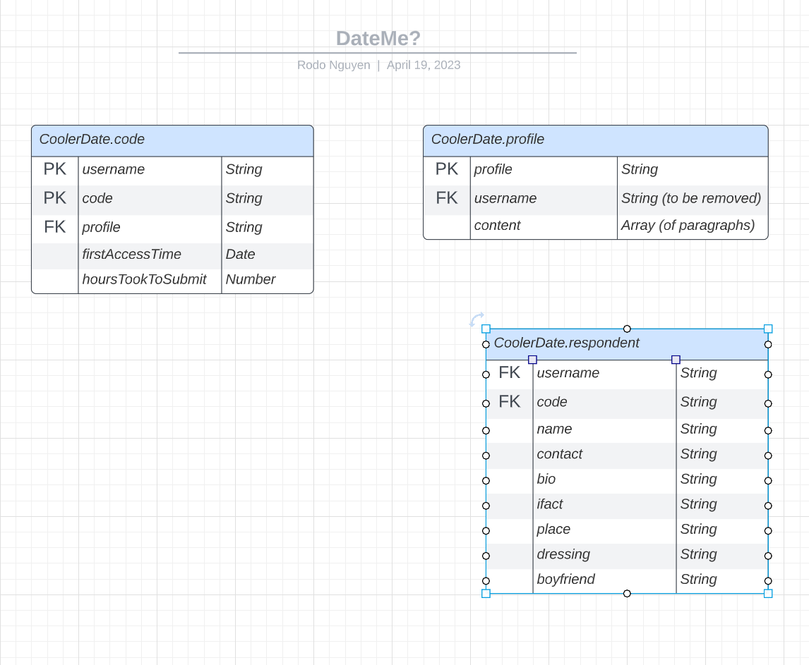

# CoolerDate

### A full-stack application built for Asking someone out for a date. 
### *Simpler, Easier and Even More Special Process!*
### Make the person being asked feel valued. Just give the them a *customised, unique and exclusive* invitation code (one person per code) to access your profile, get to know you and response later. That code expires after 3 days since they first open it. 


### Read more about:
- [Server](#server)
- [Client](#client)

# Server

Consists of RestAPI endpoints that the Front-End use to interact with MongoDB.  
Built with: ExpressJS, Axios, Mongoose, Swagger-jsdoc.  
Tests written with: Chai.

### Getting Started

- Start the server in dev mode (with nodemon):   
   ```
   npm run dev
   ```
- Run server for deployment: 
   ```
   npm run start
   ```
- Run tests: 
   ```
   npm run test
   ```

### Documentation
Once the server is up and running (by entering `npm run dev`), interactive Swagger Documentation can be found in 
   ```
   http://127.0.0.1:3001/coolerdate/api-docs
   ```

# Database Schema

## 0. The database schema itself



To improve: 
- remove `username` in `profile`. 
- aggregate unrequired response sections to an array, giving room for flexible, customised questions form.

## 1. Username + Code 
Each user has a `username` and they can create their own customised `code`s to give out.

Together, `(username, code)` must unique in the database. `(username, code)` can be linked to a desired **`profile`** and its associated **`respondent`** (if available). 

## 2. Profile
The `profile` can be linked to 1 or more `(username, code)`. This gives users the freedom to assign a suitable profile bio fitting each receiver (to the best of the giver's opinion). For example, this profile bio can be for long-term relationship and may present more traits that attract such relationships, and a diffrent bio can be for one-night stand with *bolder* introduction. 

The receiver is who receives the code.


## 3. Respondent
This stores response from receiver if they decided to give response to each `(username, code)`.


<br>

# Client

For the time being, you can access the code at [this link](https://github.com/rodonguyen/my_website/blob/master/src/pages/DateMe.js). Future plan is to migrate it to an independent repository. 
